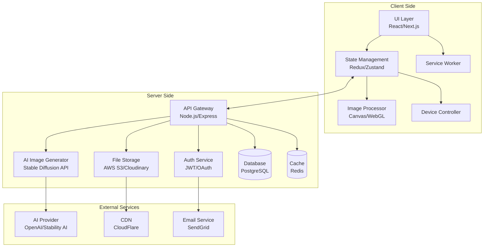

# iPhone壁紙作成ツール 設計書

## Overview

iPhone壁紙作成ツールは、ユーザーがWebブラウザ上で直感的にiPhone各モデルに最適化された壁紙を作成できるプログレッシブWebアプリケーション（PWA）です。本システムは、クライアントサイドでの画像処理を中心としたSPA（Single Page Application）アーキテクチャを採用し、バックエンドAPIサーバーによるAI生成機能とユーザーデータ管理をサポートします。

### システムアーキテクチャの概要

本システムは以下の主要な技術的特徴を持ちます：

- **レスポンシブWebデザイン**: デバイス検出とモバイルファーストアプローチ
- **リアルタイム画像処理**: Canvas APIとWebGLを活用した高速レンダリング
- **AI統合**: Stable DiffusionまたはDALL-E APIを用いた画像生成
- **プログレッシブエンハンスメント**: オフライン対応とインストール可能なPWA
- **セキュアなデータ管理**: JWT認証とAES-256暗号化による保護

## Architecture

### システム全体の構成



### 主要コンポーネント間の関係

1. **フロントエンド層**
   - React/Next.jsベースのSPAが全体のUIを管理
   - Redux/Zustandによる状態管理でアプリケーション全体のデータフローを制御
   - Canvas APIとWebGLを使用したクライアントサイド画像処理
   - Service Workerによるオフライン対応とキャッシング

2. **バックエンド層**
   - RESTful API（将来的にGraphQL移行可能）
   - マイクロサービス志向のアーキテクチャ
   - 水平スケーリング可能な設計

3. **データストレージ層**
   - PostgreSQLでユーザーデータとメタデータを管理
   - S3/Cloudinaryで画像ファイルを保存
   - Redisでセッションとキャッシュを管理

### データフローの説明

1. **画像作成フロー**
   ```
   ユーザー入力 → デバイス検出 → テンプレート/写真選択 → 
   編集処理（クライアント） → プレビュー生成 → 
   最終レンダリング → ダウンロード/保存
   ```

2. **AI生成フロー**
   ```
   プロンプト入力 → APIリクエスト → キュー管理 → 
   AI API呼び出し → 画像生成 → 後処理 → 
   クライアント返却 → 編集可能状態
   ```

3. **認証フロー**
   ```
   ログイン要求 → 認証サービス → JWT発行 → 
   クライアント保存 → APIリクエスト時の検証
   ```

## Components and Interfaces

### 各コンポーネントの詳細設計

#### 1. デバイスコントローラー (DeviceController)

```typescript
interface DeviceController {
  detectDevice(): DeviceInfo;
  getDeviceSpecs(model: string): DeviceSpecification;
  getOptimalResolution(device: DeviceInfo): Resolution;
  adjustForNotch(image: ImageData, device: DeviceInfo): ImageData;
}

interface DeviceInfo {
  model: string;
  screenSize: { width: number; height: number };
  pixelRatio: number;
  hasNotch: boolean;
  hasDynamicIsland: boolean;
  notchDimensions?: { x: number; y: number; width: number; height: number };
}

interface DeviceSpecification {
  model: string;
  displayName: string;
  resolution: Resolution;
  aspectRatio: string;
  features: string[];
}
```

#### 2. テンプレートマネージャー (TemplateManager)

```typescript
interface TemplateManager {
  getTemplates(category?: string): Template[];
  loadTemplate(templateId: string): TemplateData;
  applyTemplate(template: TemplateData, customizations: Customization): ImageData;
  saveCustomTemplate(template: TemplateData, userId: string): Promise<string>;
}

interface Template {
  id: string;
  name: string;
  category: string;
  thumbnail: string;
  customizableElements: CustomizableElement[];
  premium: boolean;
}

interface TemplateData {
  layers: Layer[];
  dimensions: Resolution;
  metadata: TemplateMetadata;
}
```

#### 3. 画像プロセッサー (ImageProcessor)

```typescript
interface ImageProcessor {
  loadImage(file: File): Promise<ImageData>;
  resize(image: ImageData, dimensions: Resolution): ImageData;
  crop(image: ImageData, cropArea: CropArea): ImageData;
  applyFilter(image: ImageData, filter: Filter): ImageData;
  adjustColors(image: ImageData, adjustments: ColorAdjustments): ImageData;
  applyBlur(image: ImageData, blurType: BlurType, intensity: number): ImageData;
  addGradientOverlay(image: ImageData, gradient: Gradient): ImageData;
  generatePreview(image: ImageData, device: DeviceInfo): PreviewData;
}

interface ColorAdjustments {
  brightness: number;
  contrast: number;
  saturation: number;
  exposure: number;
  temperature: number;
  tint: number;
}

interface Filter {
  name: string;
  matrix: number[][];
  intensity: number;
}
```

#### 4. AI画像ジェネレーター (AIImageGenerator)

```typescript
interface AIImageGenerator {
  generateImage(prompt: string, style: StylePreset, dimensions: Resolution): Promise<GeneratedImage[]>;
  refineImage(imageId: string, refinementPrompt: string): Promise<GeneratedImage>;
  getGenerationStatus(jobId: string): Promise<GenerationStatus>;
  cancelGeneration(jobId: string): Promise<void>;
}

interface GeneratedImage {
  id: string;
  url: string;
  metadata: GenerationMetadata;
  variations: string[];
}

interface GenerationMetadata {
  prompt: string;
  style: string;
  model: string;
  seed: number;
  timestamp: Date;
}
```

### API仕様

#### RESTful API エンドポイント

```yaml
# 認証関連
POST   /api/auth/register
POST   /api/auth/login
POST   /api/auth/logout
POST   /api/auth/refresh
POST   /api/auth/social/{provider}

# デバイス関連
GET    /api/devices
GET    /api/devices/{model}/specs

# テンプレート関連
GET    /api/templates
GET    /api/templates/{id}
POST   /api/templates/custom
DELETE /api/templates/custom/{id}

# 画像処理関連
POST   /api/images/upload
POST   /api/images/process
GET    /api/images/{id}/preview

# AI生成関連
POST   /api/ai/generate
GET    /api/ai/status/{jobId}
POST   /api/ai/cancel/{jobId}
GET    /api/ai/styles

# ユーザー作品関連
GET    /api/gallery
POST   /api/gallery/save
GET    /api/gallery/{id}
PUT    /api/gallery/{id}
DELETE /api/gallery/{id}
POST   /api/gallery/{id}/share

# ダウンロード関連
POST   /api/download/prepare
GET    /api/download/{token}
```

## Data Models

### データ構造の定義

#### 1. ユーザーモデル

```typescript
interface User {
  id: string;
  email: string;
  username: string;
  authProvider: 'email' | 'google' | 'apple';
  plan: 'free' | 'premium';
  createdAt: Date;
  updatedAt: Date;
  profile: UserProfile;
  settings: UserSettings;
}

interface UserProfile {
  displayName: string;
  avatar?: string;
  bio?: string;
  socialLinks?: SocialLink[];
}

interface UserSettings {
  defaultDevice?: string;
  preferredLanguage: string;
  emailNotifications: boolean;
  autoSave: boolean;
  theme: 'light' | 'dark' | 'auto';
}
```

#### 2. 壁紙作品モデル

```typescript
interface Wallpaper {
  id: string;
  userId: string;
  title: string;
  description?: string;
  type: 'template' | 'upload' | 'ai_generated';
  deviceModel: string;
  resolution: Resolution;
  imageUrl: string;
  thumbnailUrl: string;
  editData?: EditSession;
  tags: string[];
  isPublic: boolean;
  likes: number;
  downloads: number;
  createdAt: Date;
  updatedAt: Date;
}

interface EditSession {
  baseImage?: string;
  templateId?: string;
  appliedFilters: AppliedFilter[];
  colorAdjustments: ColorAdjustments;
  customizations: Customization[];
  aiPrompt?: string;
  version: number;
}
```

#### 3. テンプレートモデル

```typescript
interface TemplateModel {
  id: string;
  name: string;
  category: string;
  author: string;
  version: string;
  structure: {
    layers: LayerDefinition[];
    variables: VariableDefinition[];
    constraints: Constraint[];
  };
  metadata: {
    tags: string[];
    compatibleDevices: string[];
    requiredFeatures: string[];
    premium: boolean;
    price?: number;
  };
  stats: {
    uses: number;
    rating: number;
    reviews: number;
  };
  createdAt: Date;
  updatedAt: Date;
}
```

### データベーススキーマ

```sql
-- ユーザーテーブル
CREATE TABLE users (
    id UUID PRIMARY KEY DEFAULT gen_random_uuid(),
    email VARCHAR(255) UNIQUE NOT NULL,
    username VARCHAR(100) UNIQUE NOT NULL,
    password_hash VARCHAR(255),
    auth_provider VARCHAR(50) NOT NULL,
    plan VARCHAR(20) DEFAULT 'free',
    created_at TIMESTAMP DEFAULT CURRENT_TIMESTAMP,
    updated_at TIMESTAMP DEFAULT CURRENT_TIMESTAMP
);

-- ユーザープロフィールテーブル
CREATE TABLE user_profiles (
    user_id UUID PRIMARY KEY REFERENCES users(id) ON DELETE CASCADE,
    display_name VARCHAR(200),
    avatar_url TEXT,
    bio TEXT,
    settings JSONB DEFAULT '{}'::jsonb,
    updated_at TIMESTAMP DEFAULT CURRENT_TIMESTAMP
);

-- 壁紙作品テーブル
CREATE TABLE wallpapers (
    id UUID PRIMARY KEY DEFAULT gen_random_uuid(),
    user_id UUID REFERENCES users(id) ON DELETE CASCADE,
    title VARCHAR(200) NOT NULL,
    description TEXT,
    type VARCHAR(50) NOT NULL,
    device_model VARCHAR(100) NOT NULL,
    resolution JSONB NOT NULL,
    image_url TEXT NOT NULL,
    thumbnail_url TEXT NOT NULL,
    edit_data JSONB,
    tags TEXT[],
    is_public BOOLEAN DEFAULT false,
    likes INTEGER DEFAULT 0,
    downloads INTEGER DEFAULT 0,
    created_at TIMESTAMP DEFAULT CURRENT_TIMESTAMP,
    updated_at TIMESTAMP DEFAULT CURRENT_TIMESTAMP
);

-- テンプレートテーブル
CREATE TABLE templates (
    id UUID PRIMARY KEY DEFAULT gen_random_uuid(),
    name VARCHAR(200) NOT NULL,
    category VARCHAR(100) NOT NULL,
    author UUID REFERENCES users(id),
    version VARCHAR(20) DEFAULT '1.0.0',
    structure JSONB NOT NULL,
    metadata JSONB NOT NULL,
    stats JSONB DEFAULT '{}'::jsonb,
    created_at TIMESTAMP DEFAULT CURRENT_TIMESTAMP,
    updated_at TIMESTAMP DEFAULT CURRENT_TIMESTAMP
);

-- セッション管理テーブル
CREATE TABLE sessions (
    id UUID PRIMARY KEY DEFAULT gen_random_uuid(),
    user_id UUID REFERENCES users(id) ON DELETE CASCADE,
    token_hash VARCHAR(255) UNIQUE NOT NULL,
    expires_at TIMESTAMP NOT NULL,
    created_at TIMESTAMP DEFAULT CURRENT_TIMESTAMP
);

-- AI生成ジョブテーブル
CREATE TABLE ai_generation_jobs (
    id UUID PRIMARY KEY DEFAULT gen_random_uuid(),
    user_id UUID REFERENCES users(id) ON DELETE CASCADE,
    prompt TEXT NOT NULL,
    style VARCHAR(100),
    status VARCHAR(50) NOT NULL,
    result_urls TEXT[],
    error_message TEXT,
    metadata JSONB,
    created_at TIMESTAMP DEFAULT CURRENT_TIMESTAMP,
    completed_at TIMESTAMP
);
```

## Error Handling

### エラー処理戦略

#### 1. エラー分類と処理方針

```typescript
enum ErrorCategory {
  VALIDATION = 'VALIDATION',        // 入力検証エラー
  AUTHENTICATION = 'AUTHENTICATION', // 認証エラー
  AUTHORIZATION = 'AUTHORIZATION',   // 権限エラー
  NETWORK = 'NETWORK',              // ネットワークエラー
  PROCESSING = 'PROCESSING',        // 処理エラー
  STORAGE = 'STORAGE',              // ストレージエラー
  EXTERNAL_API = 'EXTERNAL_API',   // 外部APIエラー
  SYSTEM = 'SYSTEM'                 // システムエラー
}

interface AppError {
  code: string;
  category: ErrorCategory;
  message: string;
  userMessage: string;
  details?: any;
  recoverable: boolean;
  retryable: boolean;
  retryAfter?: number;
}
```

#### 2. グローバルエラーハンドラー

```typescript
class GlobalErrorHandler {
  handle(error: AppError): ErrorResponse {
    // ログ記録
    this.logError(error);
    
    // ユーザー通知
    if (error.category === ErrorCategory.VALIDATION) {
      return this.handleValidationError(error);
    }
    
    // リトライ可能なエラー
    if (error.retryable) {
      return this.handleRetryableError(error);
    }
    
    // 回復可能なエラー
    if (error.recoverable) {
      return this.handleRecoverableError(error);
    }
    
    // 致命的エラー
    return this.handleFatalError(error);
  }
  
  private handleValidationError(error: AppError): ErrorResponse {
    return {
      status: 400,
      message: error.userMessage,
      fields: error.details?.fields,
      suggestions: this.getValidationSuggestions(error)
    };
  }
  
  private handleRetryableError(error: AppError): ErrorResponse {
    return {
      status: 503,
      message: error.userMessage,
      retryAfter: error.retryAfter || 5000,
      action: 'RETRY'
    };
  }
}
```

#### 3. 画像処理エラーハンドリング

```typescript
class ImageProcessingErrorHandler {
  async processImage(file: File): Promise<ProcessedImage> {
    try {
      // ファイルサイズチェック
      if (file.size > MAX_FILE_SIZE) {
        throw new AppError({
          code: 'IMG_001',
          category: ErrorCategory.VALIDATION,
          message: 'File size exceeds maximum limit',
          userMessage: 'ファイルサイズが10MBを超えています。画像を圧縮してください。',
          recoverable: true,
          retryable: false
        });
      }
      
      // フォーマットチェック
      if (!SUPPORTED_FORMATS.includes(file.type)) {
        throw new AppError({
          code: 'IMG_002',
          category: ErrorCategory.VALIDATION,
          message: 'Unsupported file format',
          userMessage: `サポートされていない形式です。${SUPPORTED_FORMATS.join(', ')}形式のファイルを使用してください。`,
          recoverable: true,
          retryable: false
        });
      }
      
      // 画像処理
      return await this.processImageInternal(file);
      
    } catch (error) {
      // メモリ不足エラー
      if (error.message.includes('memory')) {
        return this.handleMemoryError(file);
      }
      
      // 破損ファイルエラー
      if (error.message.includes('corrupt')) {
        return this.handleCorruptFileError(file);
      }
      
      throw error;
    }
  }
}
```

#### 4. AI生成エラーハンドリング

```typescript
class AIGenerationErrorHandler {
  async generateWithRetry(prompt: string, maxRetries: number = 3): Promise<GeneratedImage> {
    let attempt = 0;
    let lastError: AppError;
    
    while (attempt < maxRetries) {
      try {
        return await this.generate(prompt);
      } catch (error) {
        attempt++;
        lastError = error;
        
        // レート制限エラー
        if (error.code === 'RATE_LIMIT') {
          await this.waitForRateLimit(error.retryAfter);
          continue;
        }
        
        // 不適切なコンテンツエラー
        if (error.code === 'INAPPROPRIATE_CONTENT') {
          throw new AppError({
            code: 'AI_001',
            category: ErrorCategory.VALIDATION,
            message: 'Inappropriate content detected',
            userMessage: '不適切なコンテンツが検出されました。プロンプトを修正してください。',
            recoverable: true,
            retryable: false
          });
        }
        
        // API一時的エラー
        if (error.code === 'SERVICE_UNAVAILABLE') {
          await this.exponentialBackoff(attempt);
          continue;
        }
        
        // その他のエラーは即座に投げる
        throw error;
      }
    }
    
    throw lastError;
  }
}
```

### 例外処理の方針

1. **フロントエンドエラーバウンダリー**
   - Reactエラーバウンダリーで未処理エラーをキャッチ
   - ユーザーフレンドリーなフォールバックUI表示
   - エラー報告機能の提供

2. **APIエラーレスポンス標準化**
   ```json
   {
     "error": {
       "code": "ERR_001",
       "message": "詳細なエラーメッセージ",
       "category": "VALIDATION",
       "timestamp": "2024-01-01T00:00:00Z",
       "requestId": "req_abc123",
       "details": {
         "field": "email",
         "reason": "invalid_format"
       }
     }
   }
   ```

3. **ログとモニタリング**
   - エラーレベルに応じた構造化ログ
   - Sentryなどのエラートラッキングツール統合
   - リアルタイムアラート設定

## Testing Strategy

### テスト方針

#### 1. テストピラミッド構成

```
         E2Eテスト (10%)
        /            \
    統合テスト (30%)
    /                \
単体テスト (60%)
```

#### 2. 単体テスト

```typescript
// デバイスコントローラーのテスト例
describe('DeviceController', () => {
  describe('detectDevice', () => {
    it('should correctly detect iPhone 15 Pro', () => {
      const mockUserAgent = 'Mozilla/5.0 (iPhone15,3; ...)';
      const device = deviceController.detectDevice(mockUserAgent);
      
      expect(device.model).toBe('iPhone 15 Pro');
      expect(device.hasNotch).toBe(false);
      expect(device.hasDynamicIsland).toBe(true);
      expect(device.screenSize).toEqual({ width: 1179, height: 2556 });
    });
    
    it('should fall back to manual selection on unknown device', () => {
      const device = deviceController.detectDevice('Unknown');
      expect(device).toBeNull();
    });
  });
});

// 画像プロセッサーのテスト例
describe('ImageProcessor', () => {
  describe('applyFilter', () => {
    it('should apply vintage filter correctly', async () => {
      const inputImage = await loadTestImage('test-image.jpg');
      const filter = getFilter('vintage');
      
      const result = imageProcessor.applyFilter(inputImage, filter);
      
      expect(result).toMatchImageSnapshot();
      expect(result.metadata.appliedFilters).toContain('vintage');
    });
    
    it('should handle corrupt image gracefully', async () => {
      const corruptImage = await loadTestImage('corrupt.jpg');
      
      await expect(
        imageProcessor.applyFilter(corruptImage, getFilter('blur'))
      ).rejects.toThrow(ImageProcessingError);
    });
  });
});
```

#### 3. 統合テスト

```typescript
// API統合テスト例
describe('Wallpaper Creation Flow', () => {
  it('should complete full wallpaper creation process', async () => {
    // 1. ユーザー認証
    const authResponse = await api.post('/auth/login', {
      email: 'test@example.com',
      password: 'password123'
    });
    const token = authResponse.data.token;
    
    // 2. 画像アップロード
    const formData = new FormData();
    formData.append('image', testImageFile);
    
    const uploadResponse = await api.post('/images/upload', formData, {
      headers: { Authorization: `Bearer ${token}` }
    });
    const imageId = uploadResponse.data.imageId;
    
    // 3. 画像処理
    const processResponse = await api.post('/images/process', {
      imageId,
      filters: ['vintage'],
      adjustments: { brightness: 10, contrast: 5 }
    });
    
    // 4. 壁紙保存
    const saveResponse = await api.post('/gallery/save', {
      imageId: processResponse.data.processedImageId,
      title: 'Test Wallpaper',
      deviceModel: 'iPhone 15 Pro'
    });
    
    expect(saveResponse.status).toBe(201);
    expect(saveResponse.data.wallpaperId).toBeDefined();
  });
});
```

#### 4. E2Eテスト

```typescript
// Playwright E2Eテスト例
describe('User Journey: Create AI Wallpaper', () => {
  test('should create wallpaper using AI generation', async ({ page }) => {
    // ホームページアクセス
    await page.goto('/');
    
    // ログイン
    await page.click('button:has-text("ログイン")');
    await page.fill('input[name="email"]', 'test@example.com');
    await page.fill('input[name="password"]', 'password123');
    await page.click('button[type="submit"]');
    
    // AI生成モード選択
    await page.click('button:has-text("AI生成")');
    
    // プロンプト入力
    await page.fill('textarea[name="prompt"]', '美しい夕焼けの風景');
    await page.selectOption('select[name="style"]', 'photorealistic');
    
    // 生成実行
    await page.click('button:has-text("生成開始")');
    
    // 生成完了待機（最大30秒）
    await page.waitForSelector('.generated-images', { timeout: 30000 });
    
    // 画像選択
    await page.click('.generated-images img:first-child');
    
    // デバイス選択
    await page.selectOption('select[name="device"]', 'iPhone 15 Pro');
    
    // プレビュー確認
    await page.click('button:has-text("プレビュー")');
    await expect(page.locator('.preview-container')).toBeVisible();
    
    // ダウンロード
    const downloadPromise = page.waitForEvent('download');
    await page.click('button:has-text("ダウンロード")');
    const download = await downloadPromise;
    
    expect(download.suggestedFilename()).toContain('iPhone_15_Pro');
  });
});
```

### テストケースの概要

#### 機能テストケース

1. **デバイス検出と選択**
   - 自動デバイス検出の精度
   - 手動デバイス選択の動作
   - 解像度計算の正確性

2. **テンプレート機能**
   - テンプレート読み込み
   - カスタマイズ要素の変更
   - カスタムテンプレート保存

3. **画像処理**
   - 各種フィルター適用
   - 色調整機能
   - クロップとリサイズ
   - ぼかし効果

4. **AI生成**
   - プロンプト検証
   - 生成プロセス
   - エラーハンドリング
   - バリエーション生成

5. **プレビューとダウンロード**
   - デバイスモックアップ表示
   - ホーム画面/ロック画面切り替え
   - ダウンロード形式と品質

#### 非機能テストケース

1. **パフォーマンステスト**
   - ページロード時間（< 3秒）
   - リアルタイムプレビュー更新（< 100ms）
   - 大容量画像処理

2. **セキュリティテスト**
   - XSS脆弱性チェック
   - CSRF対策確認
   - 認証・認可の検証
   - データ暗号化確認

3. **互換性テスト**
   - ブラウザ互換性（Chrome, Safari, Firefox, Edge）
   - モバイルデバイス対応
   - PWA機能テスト

4. **負荷テスト**
   - 同時接続ユーザー数
   - AI生成の同時リクエスト処理
   - データベース負荷耐性

### テスト自動化とCI/CD

```yaml
# .github/workflows/test.yml
name: Test Pipeline

on:
  push:
    branches: [main, develop]
  pull_request:
    branches: [main]

jobs:
  unit-tests:
    runs-on: ubuntu-latest
    steps:
      - uses: actions/checkout@v2
      - name: Setup Node.js
        uses: actions/setup-node@v2
        with:
          node-version: '18'
      - name: Install dependencies
        run: npm ci
      - name: Run unit tests
        run: npm run test:unit
      - name: Upload coverage
        uses: codecov/codecov-action@v2

  integration-tests:
    runs-on: ubuntu-latest
    services:
      postgres:
        image: postgres:14
        env:
          POSTGRES_PASSWORD: postgres
      redis:
        image: redis:7
    steps:
      - uses: actions/checkout@v2
      - name: Run integration tests
        run: npm run test:integration

  e2e-tests:
    runs-on: ubuntu-latest
    steps:
      - uses: actions/checkout@v2
      - name: Install Playwright
        run: npx playwright install --with-deps
      - name: Run E2E tests
        run: npm run test:e2e
      - name: Upload test artifacts
        if: failure()
        uses: actions/upload-artifact@v2
        with:
          name: playwright-report
          path: playwright-report/
```

## まとめ

本設計書では、iPhone壁紙作成ツールの技術的実装について詳細に定義しました。クライアントサイドでの高速な画像処理、AI統合による創造的な壁紙生成、そして堅牢なエラーハンドリングとテスト戦略により、ユーザーに優れた体験を提供するシステムを構築します。

各要件に対する実現方法：

1. **デバイス対応**: DeviceControllerによる自動検出と手動選択
2. **テンプレート作成**: TemplateManagerによる柔軟なカスタマイズ
3. **写真編集**: ImageProcessorによるリアルタイム処理
4. **AI生成**: AIImageGeneratorによる高品質画像生成
5. **プレビュー/ダウンロード**: 正確なデバイスモックアップと最適化された出力
6. **ユーザー管理**: 安全な認証システムと作品管理機能
7. **パフォーマンス**: WebGLとService Workerによる高速処理
8. **セキュリティ**: 多層防御とデータ暗号化による保護