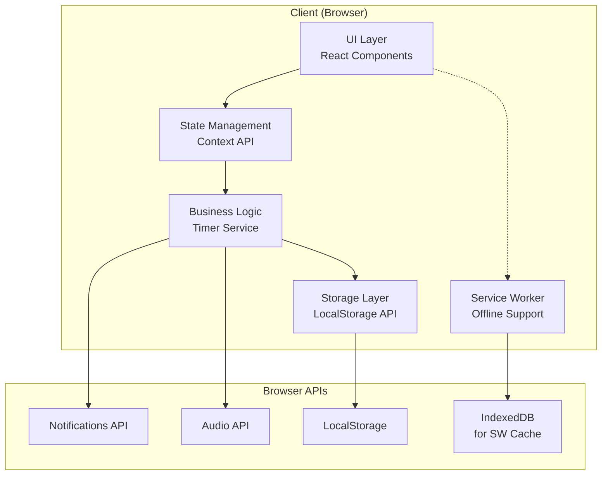
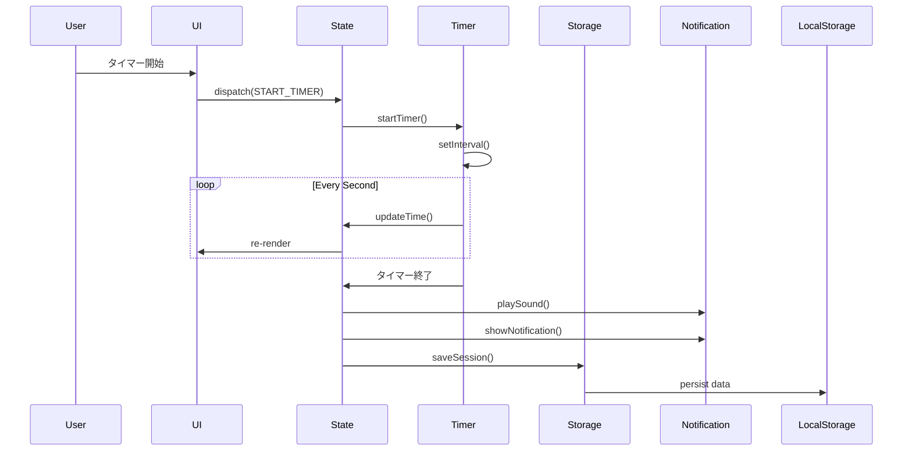
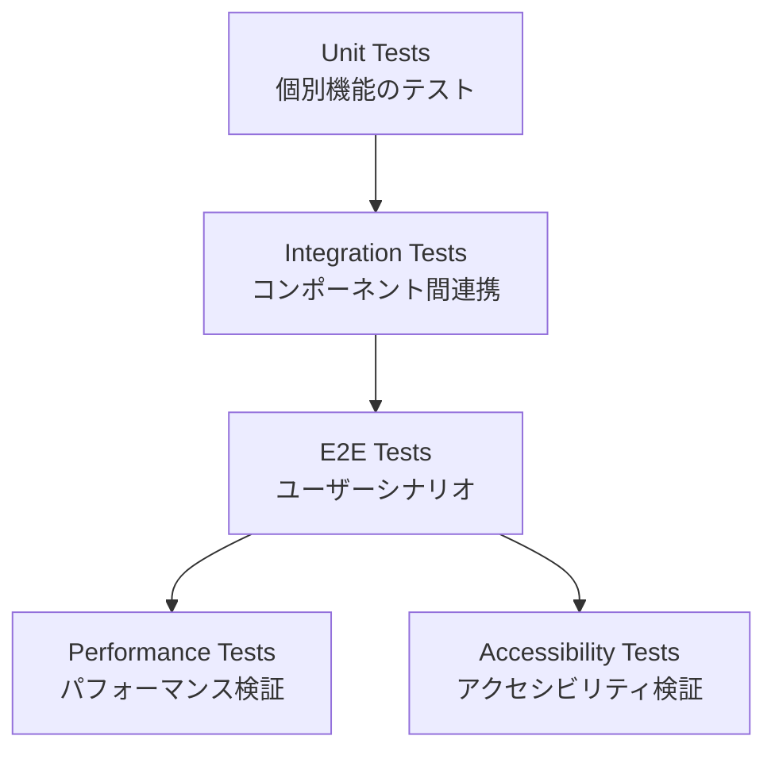

# ポモドーロタイマー設計書

## Overview

### システムアーキテクチャの概要

本ポモドーロタイマーは、Progressive Web Application (PWA) として実装され、完全にクライアントサイドで動作するシングルページアプリケーション（SPA）です。モダンなWeb技術（HTML5、CSS3、TypeScript、React）を使用し、インストール不要でブラウザから直接利用できます。

主な技術的特徴：
- **オフライン対応**: Service Workerによるキャッシング
- **レスポンシブデザイン**: モバイルからデスクトップまで対応
- **アクセシビリティ**: WCAG 2.1 AA準拠
- **データ永続化**: ローカルストレージによるデータ保存
- **リアルタイム通知**: Web Notifications APIとAudio APIの活用

## Architecture

### システム全体の構成



### 主要コンポーネント間の関係

1. **UI Layer**: ユーザーインターフェースを提供するReactコンポーネント群
2. **State Management**: アプリケーション全体の状態を管理（React Context API）
3. **Business Logic**: タイマーロジック、通知制御、データ処理
4. **Storage Layer**: データの永続化とキャッシュ管理
5. **Service Worker**: オフライン対応とリソースキャッシング

### データフローの説明



## Components and Interfaces

### 各コンポーネントの詳細設計

#### 1. Timer Component

```typescript
interface TimerProps {
  mode: 'work'  < /dev/null |  'break' | 'longBreak';
  duration: number;
  onComplete: () => void;
}

interface TimerState {
  timeRemaining: number;
  isRunning: boolean;
  isPaused: boolean;
}
```

主要機能：
- カウントダウンタイマーの表示と制御
- 開始/一時停止/リセット機能
- 視覚的なプログレス表示

#### 2. Task Manager Component

```typescript
interface Task {
  id: string;
  title: string;
  completed: boolean;
  createdAt: Date;
  completedAt?: Date;
  pomodoroCount: number;
}

interface TaskManagerProps {
  tasks: Task[];
  currentTaskId?: string;
  onTaskAdd: (title: string) => void;
  onTaskComplete: (id: string) => void;
  onTaskDelete: (id: string) => void;
  onTaskReorder: (fromIndex: number, toIndex: number) => void;
}
```

#### 3. Statistics Component

```typescript
interface SessionData {
  id: string;
  startTime: Date;
  endTime: Date;
  type: 'work' | 'break' | 'longBreak';
  taskId?: string;
  completed: boolean;
}

interface StatisticsProps {
  sessions: SessionData[];
  dateRange: 'today' | 'week' | 'month';
  onExport: () => void;
}
```

#### 4. Settings Component

```typescript
interface Settings {
  workDuration: number; // minutes
  shortBreakDuration: number;
  longBreakDuration: number;
  longBreakInterval: number; // after how many work sessions
  notificationSound: 'bell' | 'chime' | 'digital' | 'none';
  notificationVolume: number; // 0-100
  desktopNotifications: boolean;
  darkMode: boolean | 'auto';
  keyboardShortcuts: boolean;
}
```

### API仕様

#### Timer Service API

```typescript
interface TimerService {
  start(): void;
  pause(): void;
  resume(): void;
  reset(): void;
  skip(): void;
  
  getCurrentTime(): number;
  getCurrentMode(): TimerMode;
  isRunning(): boolean;
  
  // Event listeners
  onTick: (callback: (time: number) => void) => void;
  onComplete: (callback: () => void) => void;
  onModeChange: (callback: (mode: TimerMode) => void) => void;
}
```

#### Storage Service API

```typescript
interface StorageService {
  // Settings
  getSettings(): Promise<Settings>;
  updateSettings(settings: Partial<Settings>): Promise<void>;
  
  // Tasks
  getTasks(): Promise<Task[]>;
  addTask(task: Omit<Task, 'id'>): Promise<Task>;
  updateTask(id: string, updates: Partial<Task>): Promise<void>;
  deleteTask(id: string): Promise<void>;
  
  // Sessions
  getSessions(dateRange?: DateRange): Promise<SessionData[]>;
  addSession(session: Omit<SessionData, 'id'>): Promise<SessionData>;
  
  // Data management
  clearAllData(): Promise<void>;
  exportData(): Promise<ExportData>;
  getStorageUsage(): Promise<StorageUsage>;
}
```

#### Notification Service API

```typescript
interface NotificationService {
  requestPermission(): Promise<boolean>;
  hasPermission(): boolean;
  
  showNotification(title: string, options?: NotificationOptions): void;
  playSound(soundType: string, volume: number): void;
  
  // Settings
  setMuted(muted: boolean): void;
  isMuted(): boolean;
}
```

## Data Models

### データ構造の定義

#### Core Models

```typescript
// Timer related
type TimerMode = 'work' | 'break' | 'longBreak';

interface TimerSession {
  id: string;
  startTime: number; // timestamp
  endTime?: number;
  mode: TimerMode;
  duration: number; // in seconds
  completed: boolean;
  taskId?: string;
}

// Task management
interface Task {
  id: string;
  title: string;
  description?: string;
  completed: boolean;
  deleted: boolean;
  createdAt: number;
  updatedAt: number;
  completedAt?: number;
  pomodoroCount: number;
  estimatedPomodoros?: number;
  order: number; // for drag-and-drop ordering
}

// User preferences
interface UserSettings {
  // Timer settings
  workDuration: number; // minutes (1-60)
  shortBreakDuration: number; // minutes (1-30)
  longBreakDuration: number; // minutes (10-60)
  longBreakInterval: number; // after N work sessions
  autoStartBreaks: boolean;
  autoStartPomodoros: boolean;
  
  // Notification settings
  notificationSound: string;
  notificationVolume: number; // 0-100
  desktopNotifications: boolean;
  browserNotifications: boolean;
  mutedUntil?: number; // timestamp
  
  // UI settings
  theme: 'light' | 'dark' | 'auto';
  compactMode: boolean;
  showTaskList: boolean;
  showStatistics: boolean;
  
  // Accessibility
  reduceMotion: boolean;
  highContrast: boolean;
  fontSize: 'small' | 'medium' | 'large';
  
  // Privacy
  collectStatistics: boolean;
  lastDataClear?: number;
}

// Statistics
interface DailyStatistics {
  date: string; // YYYY-MM-DD
  completedPomodoros: number;
  totalFocusTime: number; // minutes
  completedTasks: number;
  sessions: TimerSession[];
}
```

### データベーススキーマ（LocalStorage）

```typescript
// LocalStorage Keys
const STORAGE_KEYS = {
  SETTINGS: 'pomodoro_settings',
  TASKS: 'pomodoro_tasks',
  SESSIONS: 'pomodoro_sessions',
  CURRENT_STATE: 'pomodoro_current_state',
  STATISTICS: 'pomodoro_statistics',
  VERSION: 'pomodoro_data_version'
} as const;

// Data versioning for migrations
interface StorageSchema {
  version: number;
  settings: UserSettings;
  tasks: Task[];
  sessions: TimerSession[];
  currentState?: {
    mode: TimerMode;
    timeRemaining: number;
    isRunning: boolean;
    currentTaskId?: string;
    sessionCount: number;
  };
}
```

## Error Handling

### エラー処理戦略

#### 1. エラーの分類

```typescript
enum ErrorType {
  STORAGE_QUOTA_EXCEEDED = 'STORAGE_QUOTA_EXCEEDED',
  NOTIFICATION_PERMISSION_DENIED = 'NOTIFICATION_PERMISSION_DENIED',
  AUDIO_PLAYBACK_FAILED = 'AUDIO_PLAYBACK_FAILED',
  INVALID_SETTINGS = 'INVALID_SETTINGS',
  DATA_CORRUPTION = 'DATA_CORRUPTION',
  BROWSER_INCOMPATIBLE = 'BROWSER_INCOMPATIBLE',
  NETWORK_OFFLINE = 'NETWORK_OFFLINE',
  SERVICE_WORKER_ERROR = 'SERVICE_WORKER_ERROR'
}

interface AppError {
  type: ErrorType;
  message: string;
  details?: any;
  recoverable: boolean;
  userAction?: string;
}
```

#### 2. エラーハンドリング実装

```typescript
class ErrorBoundary extends React.Component {
  static getDerivedStateFromError(error: Error): State {
    return { hasError: true, error };
  }
  
  componentDidCatch(error: Error, errorInfo: ErrorInfo) {
    console.error('Application error:', error, errorInfo);
    // Log to analytics service if available
  }
}

// Global error handler
window.addEventListener('unhandledrejection', (event) => {
  console.error('Unhandled promise rejection:', event.reason);
  // Show user-friendly error message
});
```

#### 3. リカバリー戦略

- **ストレージエラー**: 古いデータの自動削除、データ圧縮
- **通知エラー**: フォールバック通知方法の提供
- **オーディオエラー**: 視覚的通知へのフォールバック
- **データ破損**: バックアップからの復元、初期化オプション

### 例外処理の方針

1. **予防的エラーハンドリング**
   - 入力値の検証
   - 型安全性の確保（TypeScript）
   - 境界値チェック

2. **グレースフルデグラデーション**
   - 機能が利用できない場合の代替手段
   - 部分的な機能制限での動作継続

3. **ユーザーフィードバック**
   - 明確なエラーメッセージ
   - 実行可能な解決策の提示
   - エラー状態からの復帰方法

## Testing Strategy

### テスト方針

#### 1. テストレベル



#### 2. Unit Tests

**対象**：
- Timer logic（カウントダウン、状態遷移）
- Data models（検証、変換）
- Utility functions（時間フォーマット、計算）

**例**：
```typescript
describe('TimerService', () => {
  it('should countdown from specified duration', () => {
    const timer = new TimerService(25 * 60); // 25 minutes
    timer.start();
    
    // Fast forward 1 second
    jest.advanceTimersByTime(1000);
    
    expect(timer.getCurrentTime()).toBe(24 * 60 + 59);
  });
  
  it('should transition to break after work session', () => {
    const timer = new TimerService(25 * 60);
    timer.onComplete(() => {
      expect(timer.getCurrentMode()).toBe('break');
    });
    
    timer.start();
    jest.advanceTimersByTime(25 * 60 * 1000);
  });
});
```

#### 3. Integration Tests

**対象**：
- Component interactions
- State management flow
- Storage operations

**例**：
```typescript
describe('TaskManager Integration', () => {
  it('should persist task changes to storage', async () => {
    const { getByText, getByRole } = render(<App />);
    
    // Add task
    const input = getByRole('textbox', { name: /new task/i });
    fireEvent.change(input, { target: { value: 'Test task' } });
    fireEvent.submit(input.form);
    
    // Verify storage
    const tasks = await storageService.getTasks();
    expect(tasks).toHaveLength(1);
    expect(tasks[0].title).toBe('Test task');
  });
});
```

#### 4. E2E Tests

**シナリオ**：
1. 基本的なポモドーロサイクル完了
2. タスク管理ワークフロー
3. 設定変更と永続化
4. オフライン動作
5. 通知とサウンドの動作

#### 5. Performance Tests

**測定項目**：
- 初期ロード時間（< 3秒）
- タイマー更新のCPU使用率（< 5%）
- メモリ使用量（< 50MB）
- ストレージ使用量の最適化

#### 6. Accessibility Tests

**検証項目**：
- キーボードナビゲーション
- スクリーンリーダー対応
- カラーコントラスト（WCAG AA）
- フォーカス管理
- ARIA属性の適切な使用

### テストケースの概要

| カテゴリ | テスト数 | カバレッジ目標 |
|---------|---------|--------------|
| Unit Tests | 50+ | 90% |
| Integration | 20+ | 80% |
| E2E | 10+ | Critical paths |
| Accessibility | 15+ | WCAG AA |
| Performance | 5+ | Core metrics |

### CI/CD Integration

```yaml
# .github/workflows/test.yml
name: Test Suite
on: [push, pull_request]

jobs:
  test:
    runs-on: ubuntu-latest
    steps:
      - uses: actions/checkout@v2
      - name: Install dependencies
        run: npm ci
      - name: Run unit tests
        run: npm run test:unit
      - name: Run integration tests
        run: npm run test:integration
      - name: Run E2E tests
        run: npm run test:e2e
      - name: Check accessibility
        run: npm run test:a11y
      - name: Performance audit
        run: npm run test:performance
```
