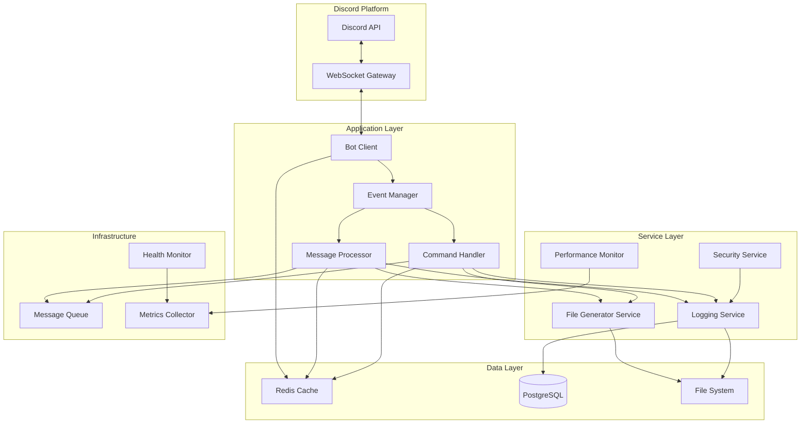

# Design Document - 運用テストシステム

## 1. Overview

### システムアーキテクチャの概要

本システムは、Discord Bot APIを基盤とするマイクロサービスアーキテクチャを採用し、以下の主要な機能を提供します：

- **リアルタイムメッセージ処理**: Discord WebSocket Gatewayを通じたイベントドリブンアーキテクチャ
- **自動ファイル生成**: ログファイル、レポート、エラー記録の自動生成とローテーション
- **コマンド実行フレームワーク**: スラッシュコマンドの登録、実行、権限管理
- **包括的エラーハンドリング**: 障害検出、自動復旧、フォールバック機構
- **パフォーマンス監視**: メトリクス収集、負荷テスト、ボトルネック検出
- **セキュリティレイヤー**: 入力検証、レート制限、認証・認可

システムは高可用性と拡張性を重視し、モジュール化された設計により将来の機能追加を容易にします。

## 2. Architecture

### システム全体の構成



### 主要コンポーネント間の関係

1. **イベント駆動フロー**
   - Discord Gateway → Bot Client → Event Manager → 各処理コンポーネント
   - 非同期処理によるノンブロッキング実行

2. **データフロー**
   - メッセージ受信 → キューイング → 処理 → 応答送信
   - キャッシュレイヤーによる高速アクセス
   - データベースへの永続化

3. **監視フロー**
   - 各コンポーネント → Metrics Collector → Performance Monitor
   - Health Monitor による死活監視

## 3. Components and Interfaces

### Bot Client Component

```typescript
interface IBotClient {
    connect(): Promise<void>;
    disconnect(): Promise<void>;
    sendMessage(channelId: string, content: MessageContent): Promise<Message>;
    registerCommand(command: SlashCommand): Promise<void>;
    on(event: string, handler: EventHandler): void;
}

class BotClient implements IBotClient {
    private client: Client;
    private rateLimiter: RateLimiter;
    private connectionManager: ConnectionManager;
    
    // WebSocket接続管理と自動再接続
    async connect(): Promise<void>;
    
    // メッセージ送信（2000文字制限対応）
    async sendMessage(channelId: string, content: MessageContent): Promise<Message>;
}
```

### Message Processor Component

```typescript
interface IMessageProcessor {
    process(message: DiscordMessage): Promise<ProcessResult>;
    prioritize(message: DiscordMessage): Priority;
    handleAttachments(attachments: Attachment[]): Promise<AttachmentMetadata[]>;
}

class MessageProcessor implements IMessageProcessor {
    private queue: PriorityQueue<DiscordMessage>;
    private mentionDetector: MentionDetector;
    private emojiProcessor: EmojiProcessor;
    
    // メッセージ処理（5秒以内のタイムアウト設定）
    async process(message: DiscordMessage): Promise<ProcessResult>;
}
```

### Command Handler Component

```typescript
interface ICommandHandler {
    register(command: SlashCommand): Promise<void>;
    execute(interaction: CommandInteraction): Promise<void>;
    validate(command: string, params: CommandParams): ValidationResult;
}

class CommandHandler implements ICommandHandler {
    private commands: Map<string, SlashCommand>;
    private permissionManager: PermissionManager;
    private helpGenerator: HelpGenerator;
    
    // コマンド実行（1秒以内の応答、5秒以上は処理中表示）
    async execute(interaction: CommandInteraction): Promise<void>;
}
```

### File Generator Service

```typescript
interface IFileGenerator {
    generateLog(event: LogEvent): Promise<void>;
    generateReport(type: ReportType, data: ReportData): Promise<string>;
    rotateFiles(directory: string, maxSize: number): Promise<void>;
}

class FileGenerator implements IFileGenerator {
    private fileSystem: FileSystem;
    private encoder: UTF8Encoder;
    private rotationManager: RotationManager;
    
    // ログファイル生成（10MB制限でローテーション）
    async generateLog(event: LogEvent): Promise<void>;
    
    // 日次レポート生成（Markdown形式）
    async generateReport(type: ReportType, data: ReportData): Promise<string>;
}
```

### API仕様

#### REST API エンドポイント

```yaml
/api/v1/health:
  get:
    description: システムヘルスチェック
    responses:
      200:
        content:
          application/json:
            schema:
              type: object
              properties:
                status: string
                uptime: number
                memory: object
                
/api/v1/metrics:
  get:
    description: パフォーマンスメトリクス取得
    parameters:
      - name: period
        in: query
        schema:
          type: string
          enum: [1h, 24h, 7d]
    responses:
      200:
        content:
          application/json:
            schema:
              type: object
              properties:
                messageRate: number
                responseTime: number
                errorRate: number
```

## 4. Data Models

### メッセージデータモデル

```typescript
interface Message {
    id: string;
    channelId: string;
    authorId: string;
    content: string;
    timestamp: Date;
    mentions: Mention[];
    attachments: Attachment[];
    reactions: Reaction[];
    metadata: MessageMetadata;
}

interface MessageMetadata {
    priority: Priority;
    processedAt?: Date;
    retryCount: number;
    errorHistory: ErrorRecord[];
}

interface Attachment {
    id: string;
    filename: string;
    size: number;
    contentType: string;
    url: string;
    metadata: AttachmentMetadata;
}
```

### コマンドデータモデル

```typescript
interface SlashCommand {
    name: string;
    description: string;
    parameters: CommandParameter[];
    permissions: Permission[];
    timeout: number;
    handler: CommandHandler;
}

interface CommandParameter {
    name: string;
    type: ParameterType;
    required: boolean;
    description: string;
    choices?: Choice[];
    validation?: ValidationRule;
}

interface CommandExecution {
    id: string;
    commandName: string;
    userId: string;
    parameters: Record<string, any>;
    startTime: Date;
    endTime?: Date;
    status: ExecutionStatus;
    result?: any;
    error?: Error;
}
```

### ログ・レポートデータモデル

```typescript
interface LogEntry {
    id: string;
    timestamp: Date;
    level: LogLevel;
    category: string;
    message: string;
    context: LogContext;
    stackTrace?: string;
}

interface Report {
    id: string;
    type: ReportType;
    generatedAt: Date;
    period: {
        start: Date;
        end: Date;
    };
    statistics: Statistics;
    content: string; // Markdown形式
}

interface Statistics {
    totalMessages: number;
    totalCommands: number;
    averageResponseTime: number;
    errorCount: number;
    uptime: number;
}
```

### データベーススキーマ

```sql
-- メッセージ履歴テーブル
CREATE TABLE messages (
    id VARCHAR(32) PRIMARY KEY,
    channel_id VARCHAR(32) NOT NULL,
    author_id VARCHAR(32) NOT NULL,
    content TEXT,
    priority INTEGER DEFAULT 0,
    processed_at TIMESTAMP,
    created_at TIMESTAMP DEFAULT CURRENT_TIMESTAMP,
    INDEX idx_channel_created (channel_id, created_at),
    INDEX idx_author (author_id)
);

-- コマンド実行履歴テーブル
CREATE TABLE command_executions (
    id UUID PRIMARY KEY DEFAULT gen_random_uuid(),
    command_name VARCHAR(100) NOT NULL,
    user_id VARCHAR(32) NOT NULL,
    parameters JSONB,
    status VARCHAR(20) NOT NULL,
    duration_ms INTEGER,
    error_message TEXT,
    executed_at TIMESTAMP DEFAULT CURRENT_TIMESTAMP,
    INDEX idx_command_user (command_name, user_id),
    INDEX idx_executed_at (executed_at)
);

-- エラーログテーブル
CREATE TABLE error_logs (
    id UUID PRIMARY KEY DEFAULT gen_random_uuid(),
    level VARCHAR(10) NOT NULL,
    category VARCHAR(50),
    message TEXT NOT NULL,
    stack_trace TEXT,
    context JSONB,
    occurred_at TIMESTAMP DEFAULT CURRENT_TIMESTAMP,
    INDEX idx_level_occurred (level, occurred_at),
    INDEX idx_category (category)
);

-- パフォーマンスメトリクステーブル
CREATE TABLE performance_metrics (
    id UUID PRIMARY KEY DEFAULT gen_random_uuid(),
    metric_type VARCHAR(50) NOT NULL,
    value DECIMAL(10, 2) NOT NULL,
    unit VARCHAR(20),
    tags JSONB,
    recorded_at TIMESTAMP DEFAULT CURRENT_TIMESTAMP,
    INDEX idx_type_recorded (metric_type, recorded_at)
);
```

## 5. Error Handling

### エラー処理戦略

#### 階層的エラーハンドリング

```typescript
class ErrorHandler {
    private retryPolicy: RetryPolicy;
    private fallbackManager: FallbackManager;
    private alertService: AlertService;
    
    async handle(error: Error, context: ErrorContext): Promise<ErrorResolution> {
        // レベル1: 即座にリトライ可能なエラー
        if (this.isRetriable(error)) {
            return this.retryWithBackoff(error, context);
        }
        
        // レベル2: フォールバック処理
        if (this.hasFallback(error)) {
            return this.executeFallback(error, context);
        }
        
        // レベル3: エラーログと通知
        await this.logAndAlert(error, context);
        
        // レベル4: グレースフルデグレード
        return this.degradeGracefully(error, context);
    }
}
```

#### 自動復旧メカニズム

```typescript
interface RecoveryStrategy {
    canRecover(error: Error): boolean;
    recover(error: Error, state: SystemState): Promise<RecoveryResult>;
}

class AutoRecovery {
    private strategies: RecoveryStrategy[] = [
        new ConnectionRecovery(),      // Discord接続の自動復旧
        new DatabaseRecovery(),         // DB接続の自動復旧
        new MemoryRecovery(),          // メモリ不足の自動回復
        new RateLimitRecovery(),       // レート制限の自動調整
    ];
    
    async attemptRecovery(error: Error): Promise<boolean> {
        for (const strategy of this.strategies) {
            if (strategy.canRecover(error)) {
                const result = await strategy.recover(error, this.getSystemState());
                if (result.success) {
                    return true;
                }
            }
        }
        return false;
    }
}
```

### 例外処理の方針

1. **予期されるエラー**
   - API レート制限 → 指数バックオフでリトライ
   - ネットワークタイムアウト → 最大3回までリトライ
   - 権限不足 → ユーザーに通知して処理継続

2. **予期しないエラー**
   - 未処理例外 → エラーログに記録、処理を継続
   - メモリ不足 → ガベージコレクション実行、リソース解放
   - クリティカルエラー → 管理者通知、グレースフルシャットダウン

3. **データ整合性エラー**
   - トランザクションロールバック
   - キャッシュ無効化
   - データ修復プロセスの起動

## 6. Testing Strategy

### テスト方針

#### テストピラミッド

```
         /\
        /  \  E2Eテスト (10%)
       /    \ - 完全な機能フロー
      /------\ 
     /        \ 統合テスト (30%)
    /          \ - コンポーネント間連携
   /------------\
  /              \ ユニットテスト (60%)
 /                \ - 個別機能の検証
/------------------\
```

### テストケースの概要

#### ユニットテスト

```typescript
describe('MessageProcessor', () => {
    describe('process', () => {
        it('should process message within 5 seconds', async () => {
            const message = createMockMessage();
            const result = await processor.process(message);
            expect(result.duration).toBeLessThan(5000);
        });
        
        it('should prioritize messages with mentions', () => {
            const mentionMessage = createMockMessage({ hasMention: true });
            const normalMessage = createMockMessage({ hasMention: false });
            expect(processor.prioritize(mentionMessage)).toBeGreaterThan(
                processor.prioritize(normalMessage)
            );
        });
        
        it('should handle message splitting for >2000 chars', async () => {
            const longMessage = 'a'.repeat(3000);
            const results = await processor.sendMessage(channelId, longMessage);
            expect(results).toHaveLength(2);
        });
    });
});
```

#### 統合テスト

```typescript
describe('Bot Integration', () => {
    it('should handle Discord connection lifecycle', async () => {
        await bot.connect();
        expect(bot.isConnected()).toBe(true);
        
        // シミュレート接続断
        await simulateDisconnect();
        await wait(1000);
        
        // 自動再接続を確認
        expect(bot.isConnected()).toBe(true);
    });
    
    it('should process commands end-to-end', async () => {
        const interaction = createMockInteraction('/test param:value');
        await commandHandler.execute(interaction);
        
        const response = await getResponse(interaction.id);
        expect(response).toBeDefined();
        expect(response.status).toBe('success');
    });
});
```

#### パフォーマンステスト

```typescript
describe('Performance Tests', () => {
    it('should handle 100 messages per second', async () => {
        const messages = generateMessages(100);
        const startTime = Date.now();
        
        await Promise.all(messages.map(msg => processor.process(msg)));
        
        const duration = Date.now() - startTime;
        expect(duration).toBeLessThan(1000);
    });
    
    it('should maintain stable memory usage over 24 hours', async () => {
        const initialMemory = process.memoryUsage().heapUsed;
        
        // 24時間のシミュレーション（高速化）
        await simulateTraffic({ hours: 24, accelerated: true });
        
        const finalMemory = process.memoryUsage().heapUsed;
        const memoryGrowth = (finalMemory - initialMemory) / initialMemory;
        
        expect(memoryGrowth).toBeLessThan(0.1); // 10%未満の増加
    });
});
```

#### セキュリティテスト

```typescript
describe('Security Tests', () => {
    it('should sanitize command injection attempts', () => {
        const maliciousInput = '; rm -rf /';
        const sanitized = security.sanitize(maliciousInput);
        expect(sanitized).not.toContain(';');
        expect(sanitized).not.toContain('rm');
    });
    
    it('should enforce rate limiting', async () => {
        const requests = Array(150).fill(null).map(() => 
            api.request('/api/v1/metrics')
        );
        
        const results = await Promise.allSettled(requests);
        const rejected = results.filter(r => r.status === 'rejected');
        
        expect(rejected.length).toBeGreaterThan(0);
    });
    
    it('should mask sensitive data in logs', () => {
        const sensitiveData = { token: 'secret123', user: 'test' };
        const logged = logger.format(sensitiveData);
        expect(logged).toContain('***');
        expect(logged).not.toContain('secret123');
    });
});
```

### テスト環境

- **ユニットテスト**: Jest + TypeScript
- **統合テスト**: Docker Compose による環境構築
- **負荷テスト**: K6 または Artillery
- **CI/CD**: GitHub Actions による自動テスト実行

### カバレッジ目標

- コードカバレッジ: 80%以上
- ブランチカバレッジ: 70%以上
- 主要フロー: 100%カバレッジ
EOF < /dev/null
